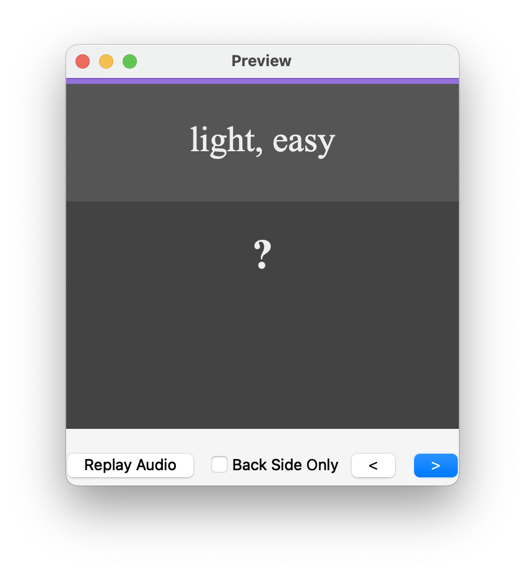
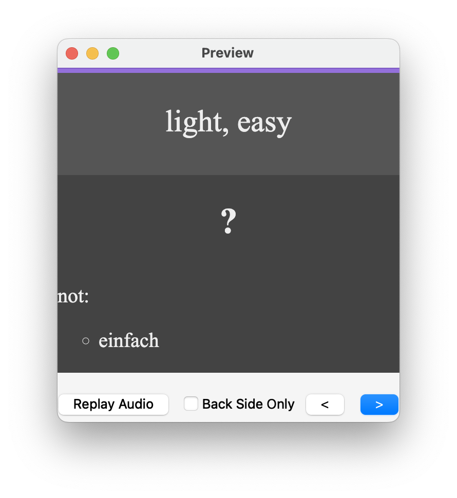

# anki-disambiguate

## Who
George Hafiz @deed02392

## What
For word vocabulary decks, this script lets you identify which of your cards are missing a disambiguation entry.

### Example usage

I have two notes with German words that can translate to 'easy':

```
"einfach" not found in disambiguate list for "easy" (1493040130853): []
"leicht" not found in disambiguate list for "easy" (1493040130701): []
```

When learning, I might get asked to translate "easy" to its German word. I know there are two options for this "leicht" and "einfach", and the script has pointed out that for `nid:1493040130853`, 
which corresponds to the card for "leicht", I haven't specified in the disambiguation list that this card is not looking for the `WordTranslation` field answer of "einfach".



I need to update both these cards' `WordTranslationDisambiguation` fields to reference each other. I can find the cards through the note ID search syntax `nid:1493040130853` in Browse. Now the same card will let me know which words aren't the right answer.



This wasn't the best example, since "light" already indicates that "einfach" wouldn't be a valid translation, but hopefully it illustrates the idea for the cases when the English side of your card is a single ambiguous word.
